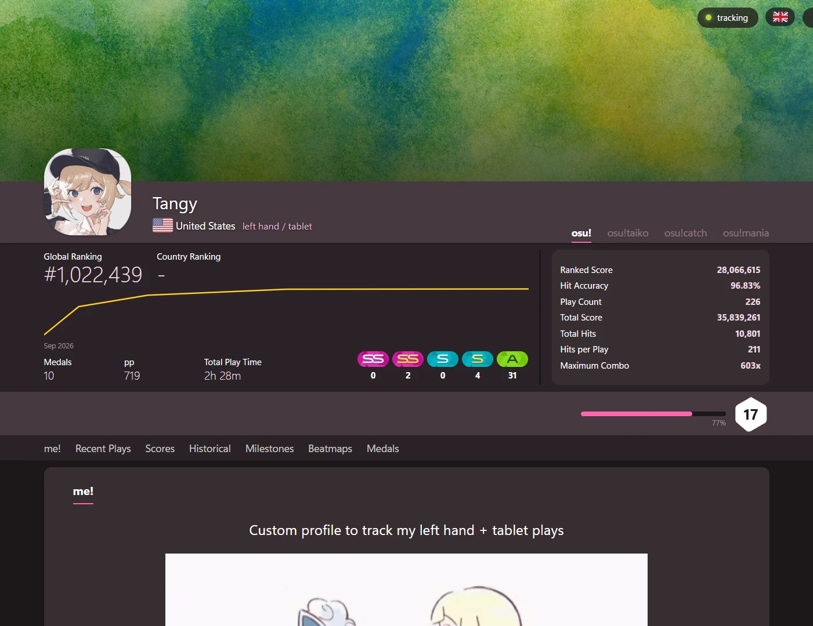
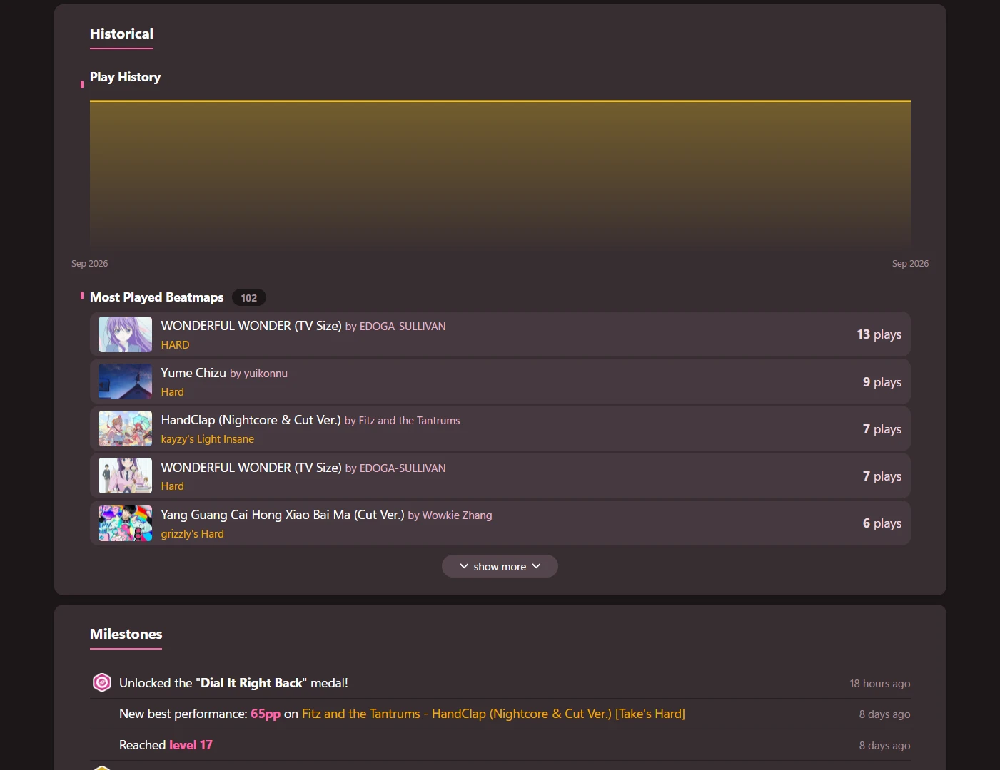
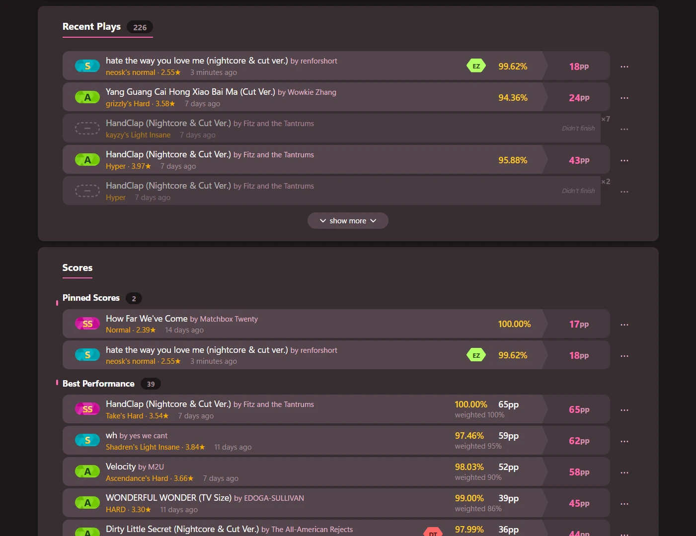
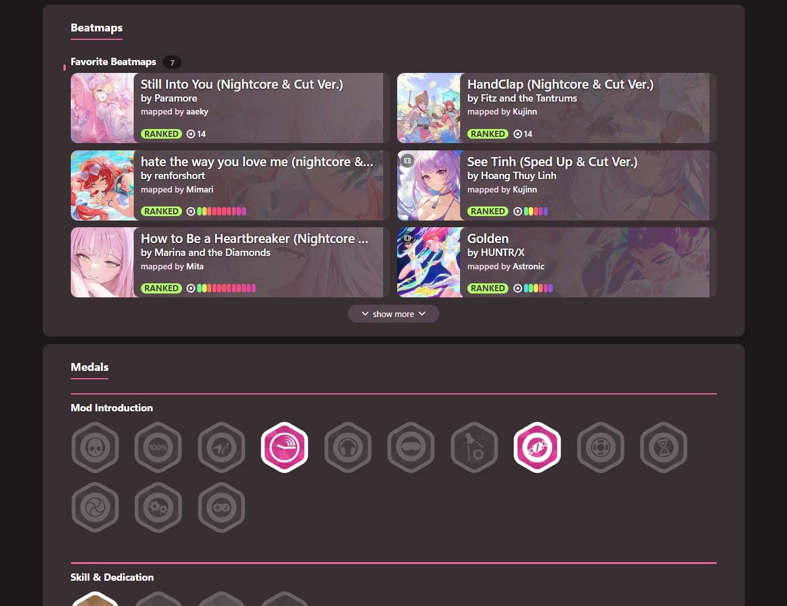

# osu! local profiles

App that tracks local / offline profiles in a browser profile page that resembles the official osu! site. App watches for plays while it is running, then calculates pp and records to profile. Inspired by [Sheppsu's osu-score-tracker](https://github.com/Sheppsu/osu-score-tracker), [Kariyu's YouTube video](https://youtu.be/5wVU4kYC3So), and McOsu.

Preview sample profile: https://jonathant09.github.io/osu-local-profiles/

Good for:
- Creating multiple profiles to track pp without multiaccounting
- Alternative playstyles - e.g. using non-dominant hand, mouse/tablet, touchscreen
- Tracking only certain plays - e.g. unranked maps, old maps, EZ mod only, etc.
- Speedrun or restriction challenges - e.g. "How fast can I reach 5 digit", "Reaching 5 digit with no misses", "Who can get the most pp before the time runs out"
- Players with no internet connection or unstable connections as this app works fully offline

Supports:
- osu!stable, osu!lazer and McOsu
- All 4 gamemodes: standard, mania, catch, taiko
- Windows, Mac, Linux
- 16 languages

Features:
- Works fully offline  (no API key needed)
  - Internet connection is optionally used to fetch beatmap cover arts, song audio previews, or import existing profile details.
- Switching between multiple profiles
- Default gamemode on launch is automatically determined by last played gamemode
- Edit or import profile details, such as Name, Avatar, Banner, me! section, scores, etc.
- pp for unranked maps and mods
- Import previous plays instead of starting a profile fresh
- Play tracking filter - only track scores that meet specified criteria, e.g. keywords, mods, difficulty, ranked date
- Option to remove scores from profile
- Automatically detects updates and installs with one click
- Recalculates pp automatically for scores on each pp rework


Last Updated:
- **pp:** osu!'s official calculator from [osu! 2026.916.0](https://github.com/ppy/osu/releases/tag/2026.916.0), which includes the July 2026 pp rework
- **Global rank estimate:** osu!'s ranking data from [September 2026](https://data.ppy.sh/)

## Screenshots

| | |
|---|---|
|  |  |
|  |  |

## Installation

1. [Download the latest release](https://github.com/jonathant09/osu-local-profiles/releases/latest) for your OS and unzip the folder.
2. Run the app as follows:

| Platform | Start | Location when running |
| -------- | ------------- | ---------------------------- |
| Windows | run `osu! local profiles.exe` | system tray |
| macOS | run `osu! local profiles` | menu bar |
| Linux | run `./osu-local-profiles` or `./start.sh` | system tray |

3. Open http://localhost:7272 in your browser.

**Note:** There is no console window. Console outputs are read to `data/logs/app.log`. To exit, click **Quit** on the top-right of the page or close the app.

**Mac users:** To allow the app to run, go to **System Settings -> Privacy & Security -> Open Anyway**, or run `xattr -dr com.apple.quarantine .` in the folder from Terminal.

## Building from source

```
npm install
npm run build:pp     # builds the osu! pp helper (needs the .NET 10 SDK)
npm run build:pp:local  # the smaller pp helper releases ship, checked against the full one
npm run dev          # or double-click start.bat
npm run check:app    # verify the install without starting to track
```

Open <http://localhost:7272>. 

## Warnings for stable

Stable users only:
- **Unranked maps will always count for pp** if lazer isn't installed, since stable doesn't record ranked status
- Scores are only tracked once you exit the results screen
- Incomplete plays (fail, quit, retry) are not tracked in Recent Plays or for playcount

## Warnings for McOsu

McOsu users only:
- Only finished, passed plays are tracked: McOsu keeps no record of fails, quits or retries,
  so they don't count in Recent Plays or for playcount
- pp comes from osu!'s current pp system, so it can differ from the pp McOsu shows
- McOsu doesn't save replays, so McOsu plays have no replay to download
- McOsu-only mods (Nightmare and experimental mods) show as one **MC** mod, and count toward
  pp only while unranked mods are counted (the default)

## Technologies Used

| Technology | Used for |
|---|---|
| TypeScript | app, using Node's type stripping (no compile) |
| Node.js 22.5+ | `node:sqlite`, `node:http`, `node:zlib` |
| Vanilla DOM, ES modules and CSS | profile page |
| .NET 10 | official pp calculator |
| Official `ppy.osu.Game.Rulesets.*` | official pp calculator |
| Go + `fyne.io/systray` | tray and menu bar launcher |
| GitHub Actions | CI and cross-platform releases |

## Online fetches (optional)

| host | assets fetched |
|---|---|
| `assets.ppy.sh` | beatmap cover art and medal icons |
| `data.ppy.sh` | rank-curve dumps when manually running `npm run rank:refresh` |
| `osu.ppy.sh` | import existing profile details and beatmap details |
| `b.ppy.sh` | song audio previews |
| `github.com` | check for new app updates |


## Play tracking flow for completed plays

App watches for a new `.osr` replay file:

```
  lazer:  %APPDATA%/osu/files/**        ─┐
  stable: <osu!>/Data/r/*.osr           ─┴─→ new file detected (recursive fs.watch)
                                                     │
                            first bytes look like a replay?
                                                     ▼
                   parse .osr  →  mods, hits, combo, score, timestamp
                                                     ▼
                  beatmap MD5  →  beatmap id + ranked status   (offline)
                                                     ▼
         local .osu  →  osu!'s own difficulty/pp calculator  →  pp   (offline)
                                                     ▼
                          store → recompute profile → live update
```

## Incomplete plays (fail, quit, retry) - *lazer only*

App reads from lazer's session log to track incomplete plays:

```
  lazer:  %APPDATA%/osu/logs/<session>.runtime.log  ──→ osu! accepted a submission
                             <session>.network.log  ──→ ...for this beatmap
                                        │
                    did it reach a results screen?  ──yes──→ it is a pass; its replay
                                        │                    is already being tracked
                                        no
                                        ▼
                   an unfinished play: counted, with no score attached
```

## Configuration

`data/config.json`

| key | default | meaning |
|---|---|---|
| `profileName` | `Local Profile` | name of the *first* profile only; after that, manage profiles from the page |
| `port` | `7272` | local web server port |
| `openBrowser` | `true` | open the page in your default browser on start -- also **Options -> Other settings -> Open in browser on start** |
| `checkForUpdates` | `true` | ask GitHub once at startup whether a newer release exists |
| `installRoots` | `[]` | explicit osu! paths if auto-detection fails |
| `country` | `""` | two-letter ISO code shown beside the profile name, as osu! shows one |
| `tagline` | `""` | what to call the playstyle, e.g. `left hand, mouse only` |
| `language` | `""` | the page's language, as one of osu!'s own codes (`de`, `pt-br`, `zh-tw`). Empty means never chosen, which is what lets the first launch ask |
| `originalMetadata` | `false` | show beatmap metadata in original language -- also the switch in the flag menu and **Options -> Other settings** |

## Development

```
npm run typecheck
npm test
npm run check        # both
npm run ui           # drives the real page in headless Chrome (app must be running)
```

## Known limitations

- The official osu! pp calculator adds ~70MB to the download (it bundles its own .NET 10 runtime)
- pp reworks require manual updates
- Global rank is an estimate and requires manual refreshes. It is interpolated from a pp->rank curve built
  from a monthly data.ppy.sh sample of the whole ladder, so it drifts as the playerbase
  grows. Refresh it with `node scripts/build-rank-table.mjs osu --dump YYYY_MM_DD`.
- Country rank is not supported
- No support for tracking incomplete plays for playcount in stable

## Credits

- [ppy/osu](https://github.com/ppy/osu) - official rulesets and performance calculator
- [ppy/osu-web](https://github.com/ppy/osu-web) - mod glyphs, grade badges, stable's grade letters, the guest avatar and mod badge styling (AGPL-3.0-or-later, © ppy Pty Ltd), plus mod and medal definitions
- [data.ppy.sh](https://data.ppy.sh) - public ladder dumps behind the pp-to-rank curves
- [Twemoji](https://github.com/jdecked/twemoji) - country flag artwork
- [fyne.io/systray](https://github.com/fyne-io/systray), [godbus/dbus](https://github.com/godbus/dbus) and [golang.org/x/sys](https://pkg.go.dev/golang.org/x/sys) for the tray launcher
- [Sheppsu's osu-score-tracker](https://github.com/Sheppsu/osu-score-tracker), [Kariyu's video](https://youtu.be/5wVU4kYC3So) and McOsu for the idea

Full license details in [THIRD-PARTY-NOTICES.md](THIRD-PARTY-NOTICES.md).

## AI Disclaimer

This is an ai-assisted project written largely with Claude Code, which I have reviewed and tested before release. Note that pp calculation uses the official osu! pp calculator.

## License

osu! local profiles is free software under the [GNU Affero General Public License v3.0 or later](LICENSE).
Versions up to and including v1.22.0 were released under the MIT License and remain available under it.

The page uses artwork and styling from [osu-web](https://github.com/ppy/osu-web) (© ppy Pty Ltd), under
osu-web's own AGPL-3.0 licence. See [THIRD-PARTY-NOTICES.md](THIRD-PARTY-NOTICES.md) for that and for
everything a release bundles. osu!'s Torus and Venera fonts are not included; if they are installed on
your computer, the page uses them.

This app does **not** contact osu! game servers, log in, use API credentials, or automate/assist gameplay in any way.

"osu!" and "ppy" are trademarks of ppy Pty Ltd. This is an unofficial community project and is not
affiliated with, endorsed by, or associated with osu! or ppy Pty Ltd.
